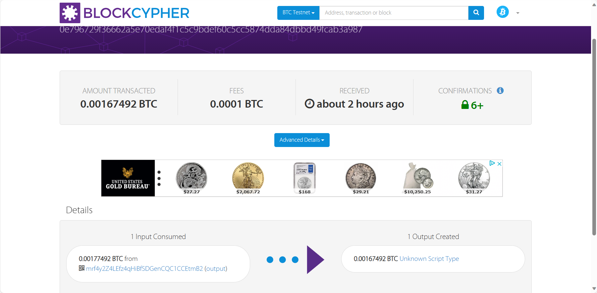
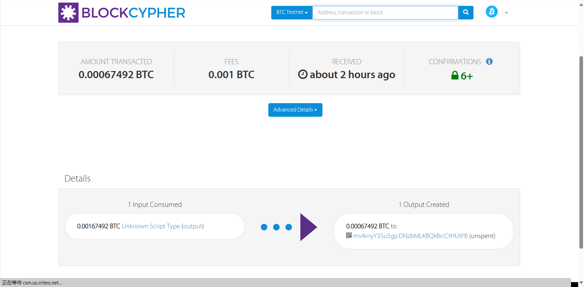

# 区块链第三次作业
2110937 计算机科学与技术 赵康明
## 一、作业内容
- （a） 生成可通过以下两个线性方程组的解（x，y）赎回的交易：
x+y=（StudentID 前 3 位）和 x-y=（StudentID 后 4 位）。为确保存在整数解，请必要时调整（顺序减 1）你的 StudentID 后 4 位，使 StudentID 前 3位和 StudentID 后 4 位奇偶性相同。

- （b） 赎回交易。赎回脚本应尽可能小。也就是说，一个有效的 scriptSig 应该是简单地将两个整数 x 和 y 发送到堆栈中。确保在 scriptPubKey 中使用了 OP_ADD 和 OP_SUB。

## 二、实验过程
### 1.Ex3a脚本填写
    本次作业要求通过线性方程组的解(x,y)赎回交易。因此我们可以从交易链中的堆栈中取出x，y进行计算。列举方程式：x+y=211和x-y=937（由于学号后四位为0937 故此处选取937）。完成如下脚本填写。
```c
# TODO: Complete the scriptPubKey implementation for Exercise 3
ex3a_txout_scriptPubKey = [
    OP_2DUP, ## 从栈顶弹出两个数x y
    OP_ADD,## x+y
    211,
    OP_EQUALVERIFY, ## 判断x+y是否等于211，若相等则继续执行脚本，若不相等则中断脚本执行
    OP_SUB,## x-y
    937,
    OP_EQUAL ##判断x-y是否等于937 由于学号后四位为0937 故此处选取937.此处不管是否相等均会继续执行脚本
]
```
将交易信息填写完整：
```c
# TODO: set these parameters correctly
    amount_to_send = 0.00177492-0.0001 ##减去交易费
    txid_to_spend = (
        'f941016fbcc1a906341213761a7ed84ec548031cd47f1eb9750afbff14b3c678')
    utxo_index = 7
```
### 2.Ex3a实验结果
交易信息：
```c
01 Created
{
  "tx": {
    "block_height": -1,
    "block_index": -1,
    "hash": "0e796729f36662a5e70edaf4f1c5c9bdef60c5cc5874dda84dbbd49fcab3a987",
    "addresses": [
      "mrf4y2Z4LEfz4qHiBfSDGenCQC1CCEtmB2"
    ],
    "total": 167492,
    "fees": 10000,
    "size": 177,
    "vsize": 177,
    "preference": "low",
    "relayed_by": "111.33.78.5",
    "received": "2023-10-17T00:34:29.819831478Z",
    "ver": 1,
    "double_spend": false,
    "vin_sz": 1,
    "vout_sz": 1,
    "confirmations": 0,
    "inputs": [
      {
        "prev_hash": "f941016fbcc1a906341213761a7ed84ec548031cd47f1eb9750afbff14b3c678",
        "output_index": 7,
        "script": "473044022060a9f4145e8a38402e570a33883f3f7d47b51dfd89fa3db7fa1c87b9d1863cdd022007878dc29f95fc6db94bd3b976d07784c7f76e8c55f7dfea2442478956e165f5012103ab8d6e4c77f782988832aad0b786447cd1253d2d09d22c0483f9513e18272c22",
        "output_value": 177492,
        "sequence": 4294967295,
        "addresses": [
          "mrf4y2Z4LEfz4qHiBfSDGenCQC1CCEtmB2"
        ],
        "script_type": "pay-to-pubkey-hash",
        "age": 2503443
      }
    ],
    "outputs": [
      {
        "value": 167492,
        "script": "6e9302d300889402a90387",
        "addresses": null,
        "script_type": "unknown"
      }
    ]
  }
}
```
检验交易结果：

### 3.Ex3b脚本填写

Ex3b要求我们赎回交易，将x和y的解写到scriptSig当中，发回堆栈当中。
填写代码如下：
```c
# TODO: set these parameters correctly
amount_to_send = 0.001674920-0.001 ## 减去交易费用
txid_to_spend = '0e796729f36662a5e70edaf4f1c5c9bdef60c5cc5874dda84dbbd49fcab3a987'
utxo_index = 0
######################################################################

txin_scriptPubKey = ex3a_txout_scriptPubKey
######################################################################
# TODO: implement the scriptSig for redeeming the transaction created
# in  Exercise 3a.
txin_scriptSig = [574,
                  -363]
```
### 4.Ex3b实验结果

