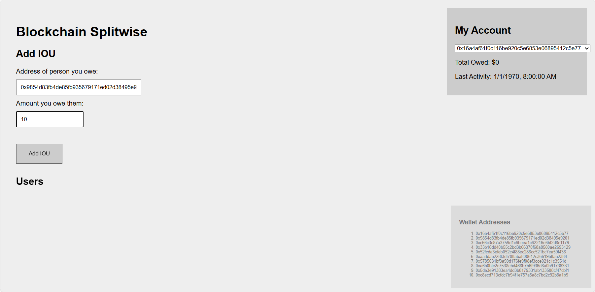
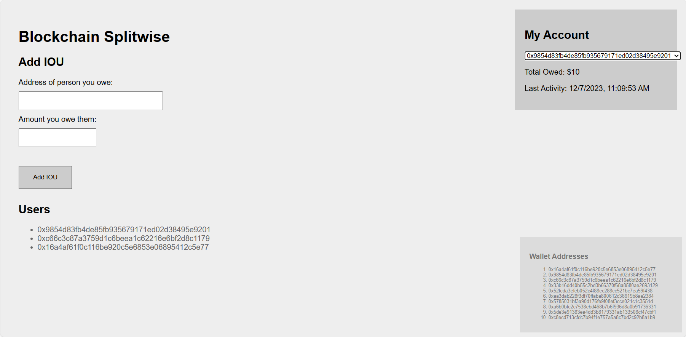
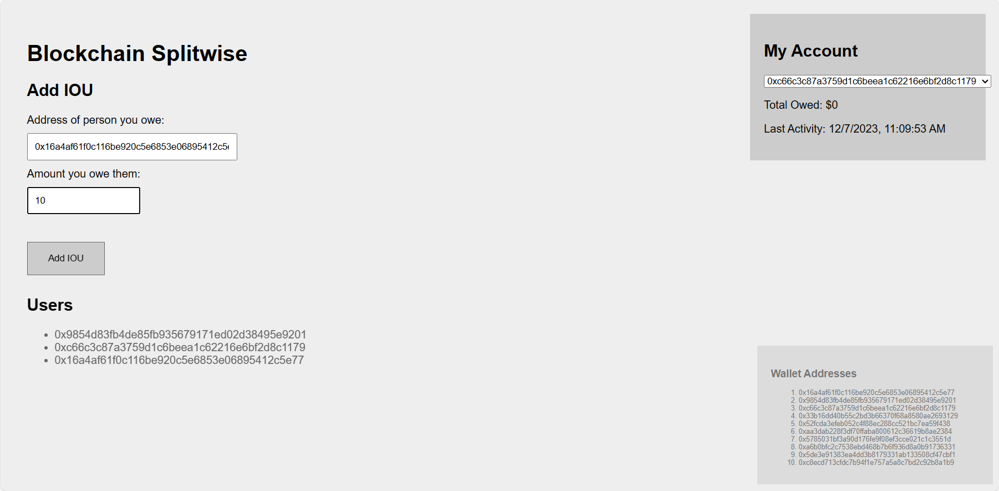
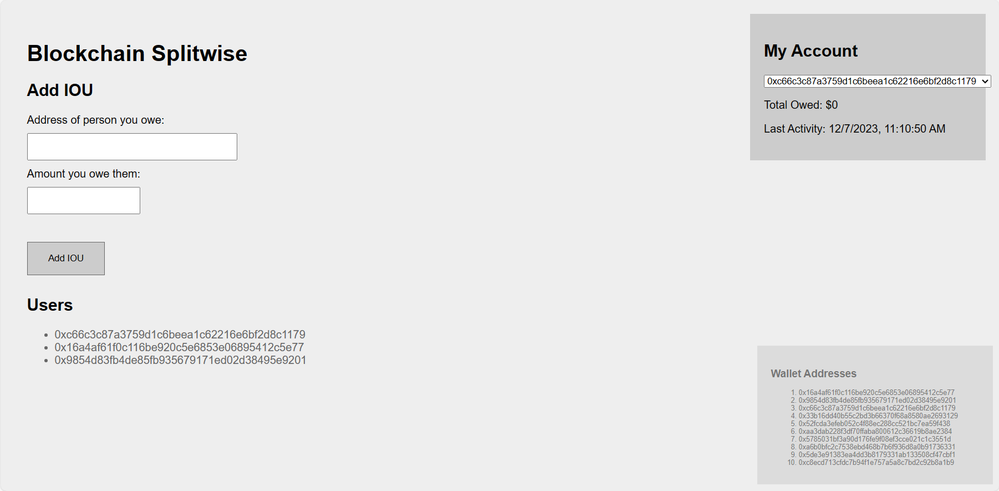

<h1 align = "center">区块链基础及应用 实验五设计文档</h1>
<h2 align = "center">2113620 任鸿宇 2110937 赵康明  计算机科学与技术</h2>

## 一、小组分工
 2113620 任鸿宇：完成后端合约函数mycontract.sol的书写
 
 2110937 赵康明：完成客户端函数script.js的书写

## 二、具体实验设计 

### 1.合约函数设计：
- 定义结构体，存储欠债金额
```c
struct Debt {
        uint32 amount;
}
```
- 创建保存欠债关系的映射all_debts, 从债务人映射到映射从债权人到债务。debts[Alice][Bob] = 10 意味着爱丽丝欠鲍勃10块钱。
```cpp
mapping(address=>mapping(address=>Debt)) internal all_debts;
```


- 检查债务循环，看债务循环是否闭环，如果闭环，则利用函数实现债务转移，破坏闭环；

    如果未发生闭环，则后续由require函数回滚事务。
```c
function make_path(address start, address end, address[] memory path, uint32 min_on_cycle) private returns (bool ret) {
        if (start != path[0] || end != path[path.length - 1]) {
            return false;
        }
        // Maximu路径大小为10，不包括开始和结束。
        if (path.length > 12) {
            return false;
        }
        for (uint i = 1; i < path.length; i++) {
            Debt storage iou = all_debts[path[i-1]][path[i]];
             // 如果欠债路径上某个两个用户之间不存在欠债关系，或者二者欠债金额小于min_on_cycle,路径更改失败
            if (iou.amount == 0 || iou.amount < min_on_cycle) {
                return false;
            }
            // 否则，进行路径更改，循环上每对欠债金额都减去min_on_cycle
            else {
                iou.amount -= min_on_cycle;
            }
        }
        return true;
```
- 溢出检查
```cpp
 function make_sure(uint32 ac, uint32 bc) internal pure returns (uint32) {
      uint32 xc = ac + bc;
      require(xc >= ac);
      return xc;
    }
```

- 查找债务人欠债权人的债务总额，就是读取之前建立的映射
```cpp
  function lookup(address debtor, address creditor) public view returns (uint32 ret) {
        ret = all_debts[debtor][creditor].amount;
}
```

- 更新两者的债务关系，path指的是债务双方存在的债务路径，min_on_cycle则为这个债务路径上的最小负债值（大于等于0），而min_on_cycle的值则由前端函数通过深度优先搜索得到。
```cpp
function add_IOU(address creditor, uint32 amount,  address[] memory path, uint32 min_on_cycle) public {
        address debtor = msg.sender;
        
        require(debtor != creditor, "Creditor cannot be creditor.");
        
        Debt storage iou = all_debts[debtor][creditor];  // assigns a reference
        
        // 如果min_on_cycle等于0，说明之前的负债关系不构成闭环，直接加上amount即可
        if (min_on_cycle == 0) {
            iou.amount = make_sure(iou.amount, amount);
            return;
        }
        // 验证min_on_cycle始终是直接欠下的金额（因为这是循环欠款的末端）
        require(min_on_cycle <= (iou.amount + amount), “min_on_cycle cannot be nore than amount。”）;
        // 遍历路径，消灭闭环
        require(make_path(creditor, debtor, path, min_on_cycle), "The path is invalid");
        // 此时添加amount不会产生闭环，直接添加amount
        iou.amount = make_sure(iou.amount, (amount - min_on_cycle));
    }
```

### 2.客户端函数设计
#### `getAllData(extractor_fn, early_stop_fn)`
- 从区块链中提取信息的函数。
- 参数 `extractor_fn` 将单个调用转换为多个值（列表）。
- 参数 `early_stop_fn` 被传递给 `getAllFunctionCalls`。
- 返回一个包含所有提取值的列表。
```javascript
function getAllData(extractor_fn, early_stop_fn) {
    const results = new Set();
    const all_calls = getAllFunctionCalls(contractAddress, 'add_IOU', early_stop_fn);
    for (var i = 0; i < all_calls.length; i++) {
        const extracted_values = extractor_fn(all_calls[i]);
        for (var j = 0; j < extracted_values.length; j++) {
            results.add(extracted_values[j]);
        }
    }
    return Array.from(results);
}

```
#### `get_creditors()`
- 返回所有债权人的列表。
- 使用 `getAllData`，提取函数从每个调用中获取债权人地址。
```javascript
// 通过调用 getCallData 返回所有债权人的列表。
// 提取函数从每个调用中提取债权人地址。
function get_creditors() {
    return getAllData((call) => {
        return [call.args[0]];
    }, null);
}

```
#### `get_user_creditors(user)`
- 返回给定用户的所有债权人的列表。
- 使用 `get_creditors` 获取所有债权人，并根据欠款金额进行过滤。
```javascript
// 返回给定用户的所有债权人的列表。
// 使用 get_creditors 获取所有债权人，并根据欠款金额进行过滤。
function get_user_creditors(user) {
    var creditors = []
    const all_creditors = get_creditors()
    for (var i = 0; i < all_creditors.length; i++) {
        const amountOwed = BlockchainSplitwise.lookup(user, all_creditors[i]).toNumber();
        if (amountOwed > 0) {
            creditors.push(all_creditors[i])
        }
    }
    return creditors;
}
```
#### `get_min_path(path)`
- 返回沿给定路径的最小欠款金额。
- 遍历路径并查找每对债务人-债权人的欠款金额。
```javascript
// 返回沿给定路径的最小欠款金额。
// 遍历路径并查找每对债务人-债权人的欠款金额。
function get_min_path(path) {
    var minOwed = null;
    for (var i = 1; i < path.length; i++) {
        const debtor = path[i-1]
        const creditor = path[i];
        const amountOwed = BlockchainSplitwise.lookup(debtor, creditor).toNumber();
        if (minOwed == null || minOwed > amountOwed) {
            minOwed = amountOwed;
        }
    }
    return minOwed;
}
```
#### `getUsers()`
- 返回系统中所有用户（债务人或债权人）的列表。
- 可以返回所有曾经发送或接收过 IOU 的人的列表或者当前欠款或被欠款的所有人的列表。
```javascript
// 返回系统中所有用户（债务人或债权人）的列表。
// 可以返回：
//   - 所有曾经发送或接收过 IOU 的人的列表
// 或者
//   - 当前欠款或被欠款的所有人的列表
function getUsers() {
    return getAllData((call) => {
        return [call.from, call.args[0]]
    }, null);
}
```
#### `getTotalOwed(user)`
- 获取指定用户欠款的总金额。
- 使用 `getCreditors` 获取所有债权人，并累加用户欠给每个债权人的金额。
```javascript
//获取指定用户欠款的总金额。
// 使用 getCreditors 获取所有债权人，并累加用户欠给每个债权人的金额。
function getTotalOwed(user) {
    var totalOwed = 0;
    const all_creditors = get_creditors();
    for (var i = 0; i < all_creditors.length; i++) {
        totalOwed += BlockchainSplitwise.lookup(user, all_creditors[i]).toNumber();
    }
    return totalOwed;
}
```

#### `getLastActive(user)`
- 获取用户最后一次发送或接收 IOU 的时间，以秒为单位自1970年1月1日起。
- 如果找不到用户的任何活动，则返回 null。
```javascript
function getLastActive(user) {
    const all_timestamps = getAllData((call) => {
        if (call.from == user || call.args[0] == user) {
            return [call.timestamp];
        }
        return [];
    }, (call) => {
        return call.from == user || call.args[0] == user;
    });
    return Math.max(all_timestamps);
}
```


#### `add_IOU(creditor, amount)`
- 向系统中添加一个 IOU（我欠你）。
- 传递给函数的参数包括欠款人（creditor）和欠款金额（amount）。
- 如果存在债务循环，通过执行路径上的最小欠款量来破坏闭环。
- 如果没有循环，直接添加 IOU。
```javascript
// 传递给函数的参数包括欠款人（creditor）和欠款金额（amount）。
// 如果存在债务循环，通过执行路径上的最小欠款量来破坏闭环。
// 如果没有循环，直接添加 IOU。
function add_IOU(creditor, amount) {
    const debtor = web3.eth.defaultAccount;
    const path = doBFS(creditor, debtor, get_user_creditors);
    if (path != null) {
        const min_on_cycle = Math.min(get_min_path
		(path), amount);
        return BlockchainSplitwise.add_IOU(creditor, amount, path, min_on_cycle);
    }
    var x = BlockchainSplitwise.add_IOU(creditor, amount, [],0);
    return;
}

```
## 三、实验成功截图
1. 地址1欠地址2 10元


2. 地址2 欠地址3 10元

3. 地址3 欠地址1 10元

在执行上面这一步之后，发现地址3账户的欠款总额为0元，说明三者之间的欠款相互抵消，依次查看1和2账户，发现其欠款总额也变回了0元。
**账户3**

**账户1**

**账户2**


证明本次实验成功！

## 四、实验总结与思考
本次实验成功实现了在以太坊上实现了一个复杂的去中心化应用，了解了智能合约的编写和客户端函数的编写。